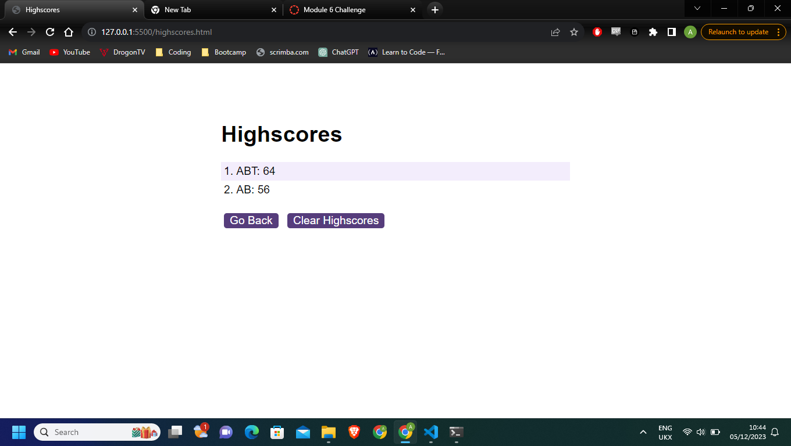
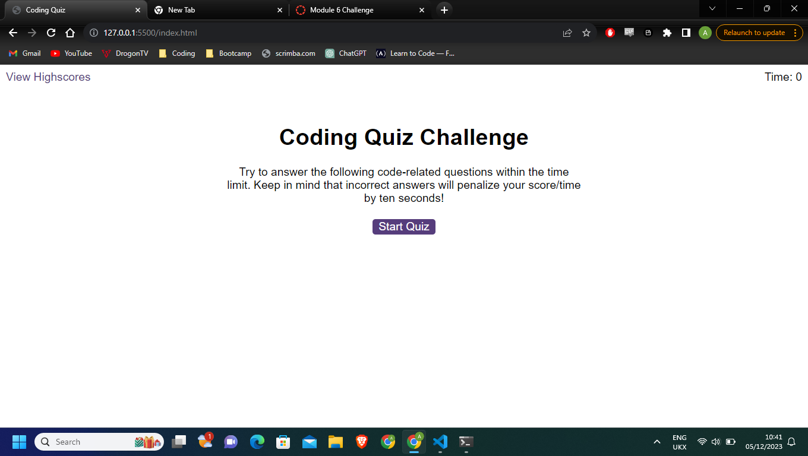
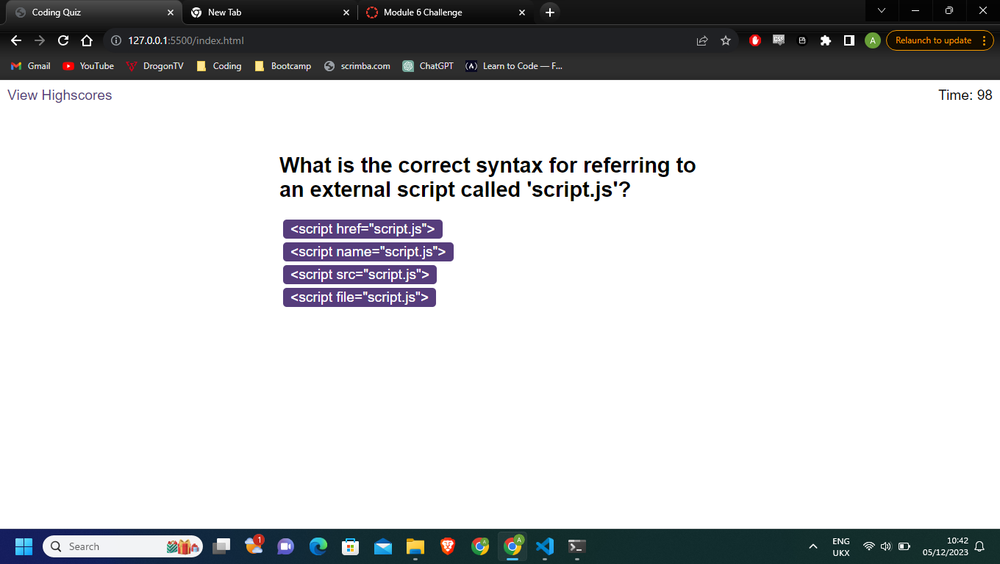
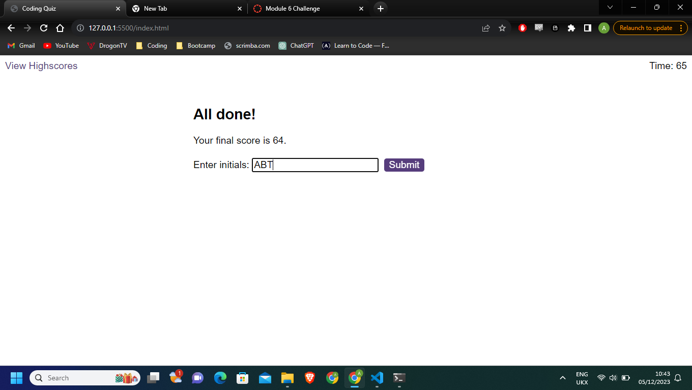

# Beginners-Coding-Quiz-Challenge

## Description

This is a short multiple choice quiz developed for my bootcamp challenge. The timer is set to 100 and will reduce by 10s for each incorrect answer. The score given is the total time remaining. This can then be stored alongside initials as a high score. Scores can be viewed on the highscore page and cleared by using the button. The starter code included the full HTML and CSS files as well as the sound effect files. 

## Installation

This is a webpage, the link to which can be found below: https://ajayabt.github.io/Beginners-Coding-Quiz-Challenge/ 

additionally, this is the link to the github repository: https://github.com/ajayabt/Beginners-Coding-Quiz-Challenge 

## Usage

 
This is a webpage. This is a short multiple choice quiz developed for my bootcamp challenge. The timer is set to 100 and will reduce by 10s for each incorrect answer. The score given is the total time remaining. This can then be stored alongside initials as a high score. Scores can be viewed on the highscore page and cleared by using the button.

## Credits
Starter code comes from the bootcamp team as described above. As mentioned, the HTML and CSS is a part of the starter file. Thank you to the bootcamp instructors and TAs who have enabled me to get this far!

## Screenshot and links

Screenshots: 
             
             
            

GitHub LINK: https://github.com/ajayabt/Beginners-Coding-Quiz-Challenge

Deployed app link: https://ajayabt.github.io/Beginners-Coding-Quiz-Challenge/ 

## License
CC0-1.0

